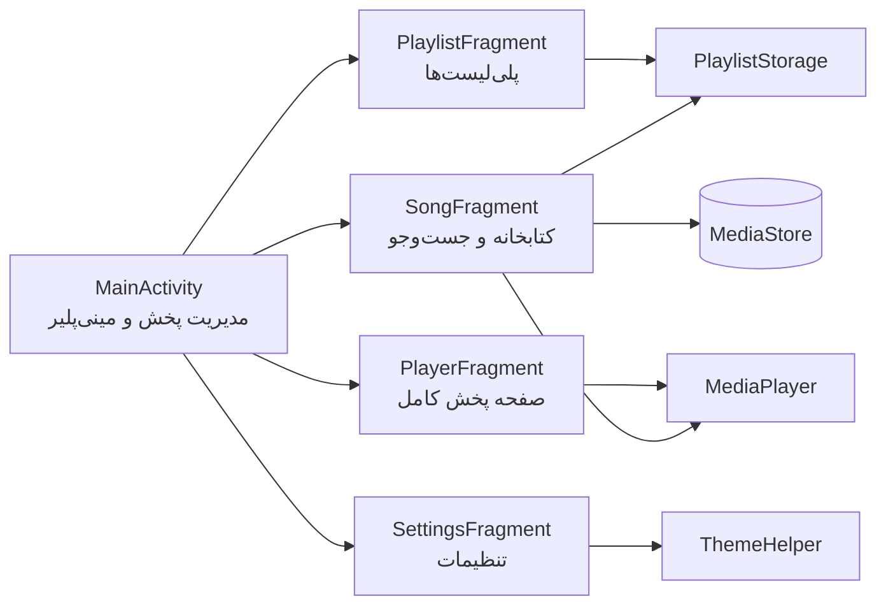

# معماری برنامه

این سند نگاه کلی به ساختار داخلی Mona Music و نحوه تعامل اجزای مختلف با یکدیگر ارائه می‌دهد.

## نمای کلی

برنامه از الگوی تک‌فعالیتی (Single Activity) پیروی می‌کند. همه صفحه‌ها Fragment هستند و بین آن‌ها با `FragmentManager` جابه‌جا می‌شویم. مسئولیت پخش صدا بر عهده `MainActivity` است تا پخش با جابه‌جایی بین صفحه‌ها قطع نشود.

## اجزای اصلی

### MainActivity

هسته برنامه و مالک اصلی شیء `MediaPlayer`. وظایف آن:

- مدیریت ناوبری پایین صفحه بین سه Fragment اصلی
- نگهداری صف پخش فعلی (لیست آهنگ‌ها و اندیس جاری)
- مدیریت مینی‌پلیر، شافل، تکرار و ترتیب آهنگ‌ها
- آزادسازی منابع پخش در `onDestroy`

### فرگمنت کتابخانه (SongFragment)

- خواندن فایل‌های صوتی از `MediaStore` با فیلتر آهنگ‌های بیشتر از ۳۰ ثانیه
- مدیریت دسترسی `READ_MEDIA_AUDIO` با `ActivityResultLauncher`
- جست‌وجوی زنده روی نام آهنگ و خواننده از طریق دو تب
- ارسال آهنگ انتخابی به `MainActivity` برای پخش

### فرگمنت پخش (PlayerFragment)

- نمایش مشخصات آهنگ جاری، کاور آلبوم و زمان‌ها
- به‌روزرسانی هر یک ثانیه از طریق `Handler`
- جابه‌جایی روی نوار پیشرفت برای تغییر لحظه پخش

### پلی‌لیست‌ها

- مدل `Playlist` فهرستی از `Song` را نگه می‌دارد
- `PlaylistStorage` پلی‌لیست‌ها را به‌صورت JSON در `SharedPreferences` ذخیره و بازیابی می‌کند
- افزودن آهنگ به پلی‌لیست از طریق لمس طولانی روی ردیف آهنگ یا دکمه بیشتر
- حذف پلی‌لیست با لمس طولانی روی کارت پلی‌لیست

### تم و حالت شب

- `ThemeHelper` تم رنگی (پیش‌فرض، آبی، صورتی) و حالت شب (سیستم، روشن، تیره) را در `SharedPreferences` نگه می‌دارد
- تم رنگی با `setTheme` قبل از `super.onCreate` اعمال می‌شود
- حالت شب با `AppCompatDelegate.setDefaultNightMode` به‌صورت سراسری اعمال می‌شود

## جریان پخش آهنگ

1. کاربر روی ردیف آهنگ در کتابخانه یا پلی‌لیست ضربه می‌زند
2. `SongFragment` یا `PlaylistFragment` لیست فعال و اندیس آهنگ را با `setSongList` به `MainActivity` می‌دهد
3. `MainActivity.playSong` نمونه قبلی `MediaPlayer` را آزاد و نمونه جدید را آماده و پخش می‌کند
4. مینی‌پلیر نمایش داده می‌شود و نوار پیشرفت با `updateMiniPlayerProgress` به‌روز می‌ماند
5. در پایان آهنگ، بسته به وضعیت تکرار، آهنگ بعدی (یا تصادفی در حالت شافل) پخش می‌شود

## تصمیم‌های طراحی

- **جاوا به‌جای کاتلین:** پروژه با هدف تمرین مفاهیم پایه اندروید در درس دانشگاه با جاوا نوشته شده است
- **بدون سرویس پس‌زمینه:** برای سادگی، پخش به چرخه حیات Activity گره خورده است؛ انتقال به Foreground Service در نقشه راه است
- **SharedPreferences به‌جای دیتابیس:** تعداد پلی‌لیست‌ها و آهنگ‌ها در این کاربرد کوچک است و JSON کفایت می‌کند
- **MediaPlayer بومی:** بدون کتابخانه خارجی مثل ExoPlayer تا حجم برنامه حداقل بماند

